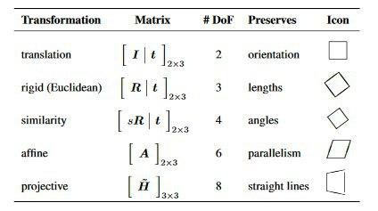

## 1.- ¿Cuál es la transformación más fuerte de la geometría de una escena que puede introducirse al tomar una foto de ella? Dar algún ejemplo.

La transformación más fuerte que puede introducirse es la **proyección**, pues puede destruir propiedades fuertes de la escena como ángulos o paralelismos.

Como un ejemplo, podemos tomar una foto de las vías de un tren desde encima de las mismas (de forma plana), que hará que parezca que no se cortarán nunca. Sin embargo, tomando la misma fotografía  de forma paralela a ellas y desde una posición baja, podremos pensar que podrían llegar a cortarse.

## 2.- Por qué es necesario usar el plano proyectivo para estudiar las transformaciones en las imágenes de fotos de escenas? Dar algún ejemplo.

Es necesario pues el proyectivo nos aporta las **aplicaciones proyectivas**, que modelan bien el comportamiento del procesamiento de imágenes de fotos, más allá de únicamente las traslaciones y las rotaciones que nos proporciona la geometría euclídea. Fuente : [projective]

Como un ejemplo, podemos decir que usamos este tipo de transformaciones para corregir perspectivas, de modo que podríamos usarlas para, dada una imagen que se ve desde el lado, verla de frente.

[projective]:http://robotics.stanford.edu/~birch/projective/projective.pdf

## 3.- Sabemos que en el plano proyectivo un punto no existe en el sentido del plano afín, sino que se define por una clase de equivalencia de vectores definida por $\{k(x,y,1), k \ne 0\}$. Razone usando las coordenadas proyectivas de los puntos afines de una recta que pase por el $(0,0)$ del plano afín y verifique que los punto de la recta del infinito del plano proyectivo son necesariamente vectores del tipo $(*,*,0)$ con $*=$cualquier número.

Los puntos del infinito son aquellos que no tienen representación en el plano afín. Vamos a ver que un punto es del infinito (no se puede representar) si y solo si su tercera coordenada es nula.

Consideramos la aplicación de inclusión del plano afín en el proyectivo:
$$
\begin{aligned}
i : \mathbb R ^2 \to \mathbb P^2 \\
i(x,y) \mapsto (x,y,1)
\end{aligned}
$$

Ahora, una recta afín que pasa por el $(0,0)$ viene dada por $r : \mathbb R \to \mathbb R^2$ con $r(t) = t(x,y)$ con $(x,y)$ un vector cualquiera. Aplicamos la inclusión a la recta:
$$
i(r(t)) = (tx,ty,1) \in \mathbb P ^2
$$
para obtener un punto del proyectivo, cuya tercera coordenada es no nula. Así, todos los puntos de la recta están representados en el proyectivo.

Ahora, si tomamos un punto del proyectivo, digamos $(x,y,z)$ con $z\ne 0$, sabemos que este es un representante de la clase de equivalencia dada en el enunciado, así que si tomamos $k = \frac{1}{z}$, tendríamos el punto $(\frac{x}{z}, \frac{y}{z},1)$, que sería el mismo que el punto inicial pues pertenece a su clase de equivalencia. Ahora, sabemos que este punto representa (tomando la inversa de la inclusión) a la recta que pasa por el $(0,0)$ con vector de dirección $(\frac{x}{z},\frac{y}{z})$, por lo que el punto $(x,y,z) \in \mathbb P^2$ tiene representación en el plano afín.

Con esto, hemos visto que cualquier punto se puede representar si su coordenada tercera en el proyectivo no es nula, así que hemos probado lo que queríamos.

## 4.-¿Qué propiedades de la geometría de un plano quedan invariantes cuando se toma una foto de él? Justificar la respuesta.
Al tomar una homografía general sobre un plano, lo único que podemos decir es que las **rectas seguirán siendo rectas**. Esto lo podemos ver en la tabla que *Szeliski* aporta en su libro :

Donde observamos que la transformación qué más propiedades hace variar, la **proyección**, mantiene las rectas.

## 5.- En coordenadas homogéneas, los puntos y las rectas del plano se representan por vectores de 3 coordenadas (notados $x$ y $l$ respectivamente), de manera que si una recta contiene a un punto se verifica $x^T l = 0$, es decir $(x_1,x_2,x_3)(a,b,c)^T = 0$. Considere una homografía $H$ que transforma vectores de puntos $, $x' = Hx$. Dado que una homografía también transforma vectores de tres coordenadas, también existen homografías $G$ para transformar vectores de rectas $l' = Gl$. Suponga una recta $l$ y un punto $x$ que verifican que $x^T l = 0$ en $\mathbb P2$ y suponga que conoce una homografía $H$ que transforma vectores de puntos. En estas condiciones, ¿cuál es la homografía $G$ que transforma los vectores de las rectas? Deducirla matemáticamente.

Sabemos que las homografías mantienen las rectas. Por tanto, $H$ aplicada a $l$ debe ser una recta nueva $l'$. Queremos buscar una homografía que dada $l$, nos dé $l' = Gl$. Ahora, $x' = Hx$ debe estar en $l'$ , así que se verificará que $(x')^T l' = 0$. Pero:
$$
 0 = (x')^T l' = (Hx)^T Gl = x^T H^T G l
$$
Así que, al imponer $H^T G = I$, tendremos $0 = x^T l$ que es lo que queríamos ver.
Para hallar explícitamente $G$, hay que tener en cuenta que $H$ es invertible por ser una homografía, y por tanto $H^T$ también lo es, así que:
$$
H^T G = I \implies G = (H^T)^{-1}
$$

## 6.- ¿Cuál es el mínimo número de escalares necesarios para fijar una homografía general? ¿Y si la homografía es afín? Justificar la respuesta

Buscamos la forma de las transformaciones en (@Szeliski p.37)

Una **homografía general**, que opera sobre coordenadas homogéneas del punto, es de la forma:
$$
x' = Hx = \begin{pmatrix} 
h_{00} & h_{01} & h_{02} \\
h_{10} & h_{11} & h_{12} \\
h_{20} & h_{21} & h{22}
\end{pmatrix} \begin{pmatrix}x \\ y \\ w \end{pmatrix}
$$
donde $H$ es una matriz $3\times 3$. Además, $H$ es homogénea, es decir, está definida en hasta una escala, y dos matrices que sólo difieren en escala son equivalentes. El $x'$ resultante debe ser normalizado para obtener un resultado coherente, de forma que:
$$
\begin{cases}
x' = \frac{h_{00}x + h_{01}y + h_{02}}{h_{20}x + h_{21}y + h_{22}} \\
y' = \frac{h_{10}x + h_{11}y + h_{12}}{h_{20}x + h_{21}y + h_{22}}
\end{cases}
$$
Por tanto,sabiendo que uno de los parámetros de la homografía, la escala, no afecta para la definición de la homografía, entonces tenemos que son **8 escalares** los necesarios.

Una **afinidad** es una transformación que se escribe también de la forma $x' = Ax$, con $A$ una matriz (@Szeliski p.37) de la forma:
$$
A = \begin{pmatrix} a_{00} & a_{01} & a_{02} \\
a_{10} & a_{11} & a_{12} \end{pmatrix}
$$
Por lo que en este caso tenemos que tomar **6 escalares**, dos menos que en la homografía general.

## 7.- Defina una homografía entre planos proyectivos que haga que el punto (3,0,2) del plano proyectivo-1 se transforme en un punto de la recta del infinito del plano proyectivo-2. Justificar la respuesta

Los puntos de la recta del infinito son de la forma $(a,b,0)$. Hay que buscar una homografía que haga que si $x = (3,0,2)$, entonces $Hx = x'$ con la tercera coordenada de $x'$ igual a 0. 

Ahora, facilitamos los cálculos, pues podemos considerar simplemente $H_{ij}$ para cada $i,j = 1,2,3$. Si operamos mirando la tercera coordenada del punto, tenemos que:
$$
x_3' = 2H_{31} + 3H_{33} = 0
$$
 
Así, si tomamos por ejemplo $H_{31} = -3$ y $H_{33} = 2$. Con esto, tendremos:
$$
H = \begin{pmatrix}
1 & 0 & 0 \\
0 & 1 & 0 \\
-3 & 0 & 2
\end{pmatrix} \implies Hx = \begin{pmatrix}
1 & 0 & 0 \\
0 & 1 & 0 \\
-3 & 0 & 2
\end{pmatrix} \begin{pmatrix} 2 \\ 0 \\ 3 \end{pmatrix} = \begin{pmatrix}2 \\ 0 \\ 0 \end{pmatrix} \in R_{\infty}
$$

## 8.- Enunciado:
 Una homografía $M= \left( \begin{array}{rrr}a & b & c \\ d & e & f \\ h & h & i\end{array} \right)=\left[ \begin{array}{rr}A & t \\ v^T & v \end{array} \right], \ det(H) \neq 0$ admite una descomposición única en movimientos elementales de la siguiente forma $H=H_SH_AH_P$, donde $H_S$ representa la homografía de una similaridad (escala, giro y traslación), $H_A$ la homografía de un movimiento afín puro y $H_P$ una transformación proyectiva pura. Es decir, $$H_S=\left( \begin{array}{rrr}s\cos \theta & -s\sin \theta & t_x \\ s\sin \theta & s\cos \theta & t_y \\ 0 & 0 & 1\end{array} \right)\equiv \left[ \begin{array}{rr}s\textbf{R} & \textbf{t} \\ \textbf{0}^T & 1 \end{array} \right], s > 0$$ $$H_A=\left( \begin{array}{rrr}a & c & 0 \\ 0 & b & 0 \\ 0 & 0 & 1\end{array}\right)\equiv  \left[ \begin{array}{rr}\textbf{K} & \textbf{0} \\ \textbf{0}^T & 1 \end{array} \right], det(K)=1$$ $$H_P=\left( \begin{array}{rrr}1 & 0 & 0 \\ 0 & 1 & 0 \\ v_1 & v_2 & v\end{array}\right)\equiv  \left[ \begin{array}{rr}\textbf{I} & \textbf{0} \\ \textbf{v}^T & v \end{array} \right], v\neq 0$$ Describir un algoritmo que permite encontrar las matrices de la descomposición de una matriz $H$ dada. Aplicarlo para encontrar la descomposición de $$H=\left( \begin{array}{rrr}1.707 & 0.586 & 1.0 \\ 2.707 & 8.242 & 2.0 \\ 1.0 & 2.0 & 1.0\end{array} \right)$$
 
**Solución**
 
 Si hacemos la operación $H_S H_A H_P$ vemos que $A = sRK + t v^T$. Tenemos que hallar $s,R$ y $K$.
 
 Tenemos $sRK = A - t v^T$ y , vemos que $det(sRK) = det(sR) det(K) = s^2 det(R) = s^2 \implies s = \sqrt{det(sRK)}$ donde hemos usado que $det(K)=1$ según el enunciado y $det(R) =1$. Desarrollamos $sRK$:
 
 $$
 sRK = s \begin{pmatrix} cos \theta & - sin \theta \\ sin \theta & cos \theta \end{pmatrix} \begin{pmatrix} a & c \\ 0 & b\end{pmatrix} 
 $$
 
 Ahora, obtenemos el siguiente sistema de ecuaciones:
 $$
 \begin{cases}
 a_{11} = s * a * cos\theta \\
 a_{12} = s * c * cos\theta - s * b * sin \theta \\
 a_{21} = s * a * sin\theta \\
 a_{22} = s * c * sin\theta + s * b * cos\theta \\
 \end{cases}
 $$
 
Tenemos que $a$ y $b$ no son cero pues $ab = det(K) = 1$. Podemos dividir en la $1$ y $3$ ecuaciones por $a$ y sustituir en las otras, usando que $\frac{1}{a} = b$ para obtener:
$$
(2)\begin{cases}
a_{12} = cba_{11} - b^2 a_{21}\\
a_{22} = cba_{21} - b^2 a_{11}
\end{cases}
$$
Así que, tenemos un sistema compatible determinado con 2 ecuaciones y 2 incógnitas (b,c). Las obtenemos, y con ellas podemos obtener $a$ y sustituir en las dos ecuaciones que habíamos *suprimido* para obtener $\theta$ usando la arcotangente adecuada (usando el seno y el coseno de $\theta$)

Vamos a aplicar esto a nuestro problema. En nuestro caso, como $v =1$, $\textbf{v}^T = (1,2)$ y $t = (1,2)^T$ , tenemos que
$$
sRK - tv^T =  sRK - \begin{pmatrix} 1 & 2 \\ 2 & 4 \end{pmatrix} = \begin{pmatrix}1.707 & 0.586 \\ 2.707 & 8.242 \end{pmatrix} \implies sRK = \begin {pmatrix}0.707 & -1.414 \\ 0.707 & 4.242 \end{pmatrix}
$$

usamos las ecuaciones que hemos obtenido en $(2)$ vemos que:
$$
\begin{cases}
-1.414 = cb0.707 - b^2 0.707\\
4.242 = cb 0.707 + b^2 0.707
\end{cases}
$$
Si realizamos la solución de este sistema con *Wolfram Alpha*,obtenemos dos soluciones, tomamos una: $b=2,c=1$. Ahora, como $a = \frac{1}{b} \implies a = \frac{1}{2}$. Si calculamos el determinante de $sRK$, nos da como resultado $det(sRK) \sim 4$, y usando que $s = \sqrt{det(sRK)}$ obtenemos que $s = 2$ pues nos quedamos con $s>0$.  Por tanto, si usamos el sistema que habíamos obtenido antes de obtener $(2)$ y tomamos las dos ecuaciones que nos quedan por resolver , y usamos que $as = \frac{1}{2}2 = 1$ , obtenemos:
$$
\begin{cases}
0.707 = cos \theta\\
0.707 = sin \theta
\end{cases}
$$

pero $0.707 \sim \frac{\sqrt{2}}{2}$ luego $\theta = 45$º. Con todo esto, tenemos:
$$
H_S = \begin{pmatrix} 2cos45 & -2sin45 & 1 \\ 2 sin 45 & 2 cos 45 & 2 \\ 0 &0& 1\end{pmatrix}, H_A = \begin{pmatrix} \frac{1}{2} & 1 & 0 \\ 0 & 2 & 0 \\ 0 & 0 & 1 \end{pmatrix},H_P = \begin{pmatrix} 1 & 0 & 0 \\ 0 & 0 & 1 \\ 1 & 2 & 1 \end{pmatrix}
$$
y esta es la descomposición de nuestra matriz $H$.

## 9.- ¿Cuáles son las propiedades necesarias y suficientes para que una matriz defina un movimiento geométrico no degenerado entre planos? Justificar la respuesta

Existen diferentes tipos de movimientos no degenerados (tabla del ejercicio 4).Para definir un movimiento no degenerado $H$  entre planos proyectivos  necesitamos que $H$ sea de dimensiones $3\times 3$ y que sea invertible, es decir, su determinante distinto de cero.

Ahora, si queremos que sea entre planos afines, su última fila debe ser proporcional a $(0,0,1)$, para que la última coordenada sea **no nula** y no sea así nunca un punto de la recta del infinito.

## 10.- ¿Qué información de la imagen usa el detector de Harris para seleccionar puntos? ¿El detector de Harris detecta patrones geométricos o fotométricos? Justificar la contestación.

El detector de Harris utiliza los **gradientes** en la imagen para seleccionar puntos. Usando los gradientes, calcula una matriz *H* simétrica que estima las cambios de curvatura en la imagen. Luego, utiliza los valores propios de esta matriz (que es diagonalizable por ser simétrica) para calcular en cada pixel la función:
$$
f_{H}(p) = \frac{det(H)}{tr(H)} = \frac{\lambda_1 * \lambda_2}{\lambda_1 + \lambda_2}
$$
Así, si obtenemos un valor alto de esta función, significará que ambos valores propios son grandes y el entorno del pixel es una zona con gran curvatura.

Además, podemos afirmar que Harris detecta patrones tanto **geométricos**, pues es capaz de detectar las esquinas, como **fotométricos**, pues detecta cambios de intensidad en las tonalidades de la imagen.

## 11.- ¿Sería adecuado usar como descriptor de un punto Harris los valores de los píxeles de su región de soporte? Identifique ventajas, inconvenientes y mecanismos de superación de estos últimos.

No es adecuado, pues aunque la región de soporte de los puntos de *Harris* puede ser invariante a ciertas transformaciones como traslación o rotación, existen movimientos geométricos que hacen que estas regiones puedan variar, como el escalado, o ciertos cambios de intensidad. Es por ello que tiene ventajas como su fácil implementación , pero incovenientes como el que hemos comentado, que existen transformaciones que hacen que el descriptor cambie. Para superar estos inconvenientes habría que tratar de hacer descriptores que fueran **invariantes a escalados**, como **SIFT** (scale invariant feature transform).

## 12.- Describa un par de criterios que sirvan para seleccionar parejas de puntos en correspondencias (“matching”) a partir de descriptores de regiones extraídos de dos imágenes. ¿Por qué no es posible garantizar que todas las parejas son correctas?

Usando dos conjuntos $D_i$, $i = 1,2$ de descriptores tenemos que elegir parejas de elementos de estos conjuntos que sean correspondencias.

- **Brute Force + crossCheck**: Tomamos un elemento del primer conjunto de descriptores y lo tratamos de emparejar con todos los del otro conjunto usando una función *distancia*, y quedándonos con el que menos distancia tenga. Además, con **crossCheck**, tomaremos solo las parejas $(i,j)$ tal que el descriptor $i-$ésimo del conjunto $D_1$, tenga al elemento $j-$ésimo del conjunto $D_2$ como mejor emparejamiento y **viceversa**.

- **Lowe Average 2NN**: Para cada elemento $d \in D_1$, tomamos los dos descriptores más cercanos (*2 Nearest Neighbours*), digamos $d_1',d_2'$  a este en el conjunto $D_2$. Calculamos entonces el *ratio* $r = \frac{dist(d,d_1')}{dist(d,d_2')}$. Si $r>umbral$, con el umbral establecido, lo descartamos pues estamos diciendo que la distancia entre la mejor correspondencia y la segunda mejor es demasiado pequeña, y por tanto hay ambiguedad. Si no supera el ratio, entonces añadimos la correspondencia $(d,d_1')$.

No podemos garantizar que todas las parejas son correctas, pues en *bruteForce* el vecino más cercano no tiene por qué ser del mismo tipo de *feature*.  Además, *Lowe* asume para su funcionamiento que $1-NN$ funciona, lo cual no es siempre cierto, por lo mismo que en el caso anterior.

## 13.- Cual es el objetivo principal del uso de la técnica RANSAC en el cálculo de una homografía. Justificar la respuesta

En un conjunto de correspondencias, podemos tener puntos que sean *outliers* (puntos que se salgan del rango de probabilidad en el conjunto de datos).
Ransac tiene como objetivo encontrar un conjunto de correspondencias entre imágenes para estimar la homografía de manera **robusta** cuando haya posibles *outliers* en el conjunto.

*Ransac* toma conjuntos de 4 pares de *matches* y hace la homografía entre ellos, e intenta maximizar las correspondencias que no sean *outliers*. Se repite este proceso un número de veces según una probabilidad de error que tomemos y conseugimos así que la homografía sea robusta y descarte los posibles *matches* erróneos.

## 14.- Si tengo 4 imágenes de una escena de manera que se solapan la 1-2, 2-3 y 3-4. ¿Cuál es el número mínimo de parejas de puntos en correspondencias necesarios para montar un mosaico? Justificar la respuesta

El número mínimo de parejas de puntos en correspondencias para tomar una homografía entre dos imágenes es 4, pues es el número que necesitamos para calcular la matriz de la homografía. Estas 4 parejas de puntos nos dan 8 ecuaciones. La última ecuación es la normalización, y obtenemos la homografía.

Así, para montar el mosaico hay que calcular, por cada par de imágenes que queramos juntar , una homografía. . Por tanto, el número de parejas de puntos que necesitamos es:
$$
4 \text{ puntos} * 3 \text{ imagenes}  = 12 \text{ puntos}
$$
es el mínimo número de puntos para hacer el mosaico. Además, no podemos hacer menos homografías para ello, asegurándonos que es el mínimo.

## 15.- ¿En la confección de un mosaico con proyección rectangular es esperable que aparezcan deformaciones geométricas de la escena real? ¿Cuáles y por qué? ¿Bajo qué condiciones esas deformaciones podrían no estar presentes? Justificar la respuesta.

**Sí** es esperable que aparezcan deformaciones en la escena. Por ejemplo, si empezamos en un sentido a construir el mosaico, el error se iría acumulando en esa dirección , y podría ser solucionado empezando el mosaico empezando por una imagen central situada en el centro del *canvas* y avanzando en ambas direcciones.

También puede ocurrir que las imágenes del mosaico estén tomadas en diferente dirección o perspectiva, lo que provoca que los *KeyPoints* de las imágenes continuas no estén totalmente alineados. Esto podemos solucionarlo realizando la proyección sobre un cilindro o una esfera en vez de sobre un canvas plano.
